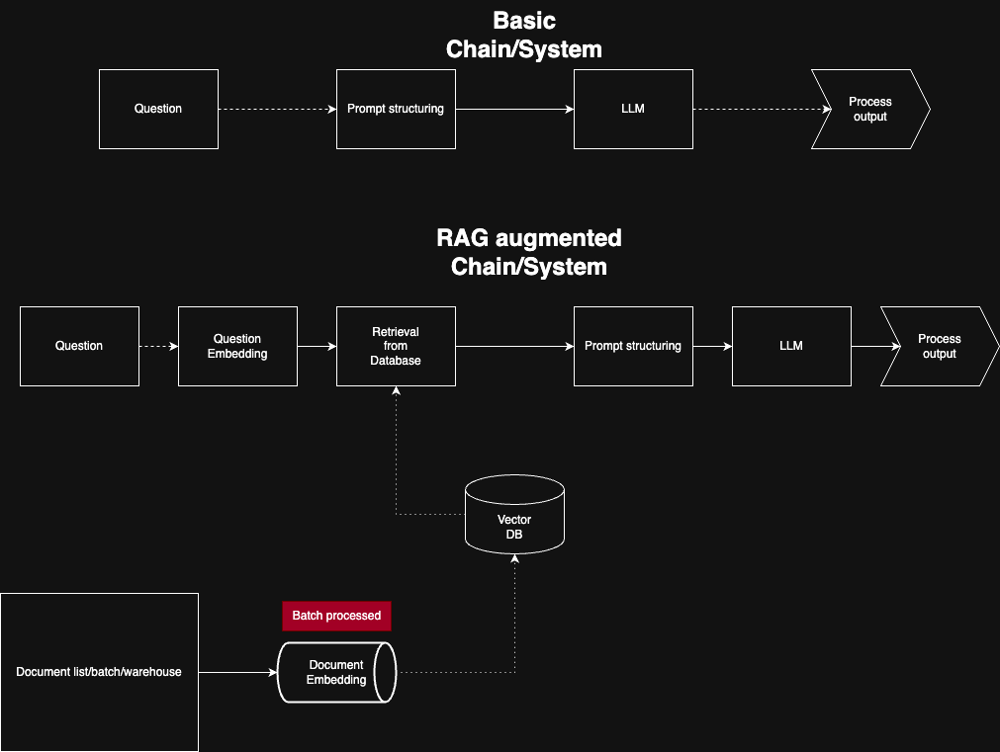

# DokuRAG

Document RAG (Retrieval-Augmented Generation) with CLI tool for managing PDF documents and querying them with AI.

## Quick Start

DokuRAG has a simple command-line interface for uploading PDF documents to a vector database from the folder 'data' and querying them with an AI assistant. You can also upload and query at the same time with one command.

## Architecture



## Installation

```bash
# Clone the repository
git clone <repository-url>
cd dokurag

# Install dependencies - if using uv
uv sync

# Install dependencies - if using normal pip and venv
python -m venv venv       # 1. Create a new env named "venv"
source venv/bin/activate  # 2. Activate it (Unix/macOS)
# OR
venv\Scripts\activate     # On Windows
pip install -r requirements.txt # 3. Install


```

## Environment Setup

Create a `.env` file in the project root with the following variables:
```
OPENROUTER_API_KEY=your_api_key_here
BASE_URL=https://openrouter.ai/api/v1
MODEL=deepseek/deepseek-r1-0528-qwen3-8b:free
```

Replace `your_api_key_here` with your actual OpenRouter API key.

You can also replace the API Key with an OpenAI API Key. the .env should then look like this:
```
OPENROUTER_API_KEY=your_api_key_here
BASE_URL=*base url of OpenAPI*
MODEL=o3
```

Note that only the first setup has been fully tested due to lack of OpenAI API keys.

### Basic Usage

```bash
# Upload a single PDF file
uv run main.py -d /path/to/document.pdf

# Upload multiple PDF files from a folder
uv run main.py -db /path/to/pdf/folder

# Prompt the LLM directly
uv run main.py -p "What is machine learning?"

# Prompt with document context from your database
uv run main.py -pd "Explain this concept"

# Run specific test
uv run main.py -t name
uv run --env-file .env python -m pytest tests/specific_test.py -v -s

# Run all tests
uv run main.py -ta

# Show help and all available options
uv run main.py -h
```

### Command Options

- `-d FILE_PATH` - Upload a single PDF file to the vector database
- `-db FOLDER_PATH` - Upload multiple PDF files from a folder to the vector database
- `-p TEXT` - Prompt the LLM with the given text
- `-pd TEXT` - Prompt the LLM with text and relevant documents from the database
- `-h` - Show help message with usage examples


## Status

🚧 **Under Development** - Core functionality is currently inplace but important production features are missing.

## Potential Future Steps

- Add ingestion for images
- Evaluation suite and regression tests for retrieval and QA quality
- Configurable chunking and overlap strategies with automatic tuning
- Pluggable embedding and LLM providers with retries, rate-limit handling, and fallbacks
- Caching of embeddings and query results; background index compaction/cleanup
- Docker packaging and one-command local/remote deployment
- Observability: structured logs, tracing, and metrics
- Lightweight web UI for browsing, searching, and chatting over documents
- Source-grounded answers with inline citations and page spans
